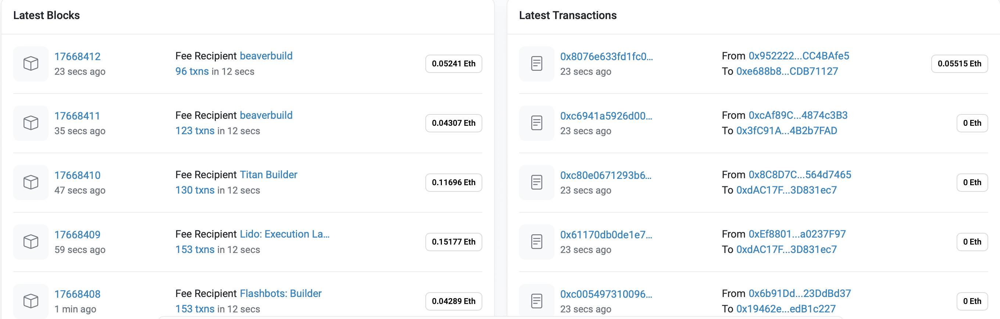

# Chapter 1: 블록체인 기초

이 장을 다 읽고 나면 블록체인과 탈중앙화 애플리케이션의 근본적인 개념들, 즉 트랜잭션, 블록의 체인, 노드, 노드의 네트워크, 그리고 이들 요소를 함께 묶어 주는 프로토콜에 대해 알게 될 것이다.

 

## 1.1 비트코인에서 블록체인으로

초기 블록체인에 열광한 이유 - 은행과 같은 중개자 없이 인간이 만든 경계를 넘어 전 세계 누구에게나 디지털 통화를 P2P로 전송할 수 있다는 점.

비암호 화폐 유형의 트랜잭션에서도 P2P 기능을 적용할 수 있다는 사실이 알려지며 블록체인 열풍이 더욱 고조됨.

비트코인의 초기 성공 이후 → 디지털 화폐를 넘어서 디지털 자산을 전송하기 위한 수단으로 개념이 확장됨 (ex. 이더리움)

> 💡 **트랜잭션(transaction)이란?** 
> 어떤 오퍼레이션을 실행할지, 그 오퍼레이션을 실행하기 위한 데이터 파라미터, 그리고 메시지 송신인, 수신인, 트랜잭션 수수료, 저장할 때의 타임스탬프 등을 포함하는 P2P 메시지로서 블록체인에 기록된다.

### 블록체인 살펴보기

이더리움 퍼블릭 블록체인 [https://etherscan.io](https://etherscan.io)

- 블록은 n개의 tx(Transaction)의 집합으로 이루어져 있다.
- 특정 블록 넘버로 검색해서 정보를 살펴볼 수 있는데 시간이 지난 후에도 해당 스크린샷에서 나온 정보가 변하지 않는다는 것을 확인할 수 있다. (블록체인 기술의 변조 불가능 속성)

 

## 1.2 블록체인이란 무엇인가?

> 💡 **블록체인(blockchain)이란?** 
> 피어 참여자들 간의 트랜잭션으로 이루어진 탈중앙화 시스템에 신뢰를 구축해주는 기술

### 블록체인의 목적
  - 참여자들이 올린 트랜잭션을 확인하고 검증
  - 해당 트랜잭션을 실행
  - 각 참여자들의 동의하에 이러한 행위들의 증거를 기록
    
### 블록체인 프로그래밍
  - 기존 시스템을 전부 대체하는 것이 아님!
  - 확인과 검증을 하는 신뢰 중개 코드를 바탕으로 기존 시스템을 개선하는 것.
    
### 블록체인 스택 (*p.7 그림 1.4 참고*)
  - 비트코인: 오직 지갑 애플리케이션만을 가짐
  - 이더리움: **스마트 컨트랙트(smart contract)** 라는 프로그래밍 가능한 코드 기능 제공

### 세 가지 레벨의 프로그래밍
  1. 프로토콜 레벨 프로그래밍(protocol-level programming)
     - 블록체인 자체의 배포와 오퍼레이션을 위해 필요한 소프트웨어와 관련됨
     - 시스템 프로그래머이거나 운영자 단에서 하는 프로그래밍
  2. 스마트 컨트랙트 레벨 프로그래밍(smart contract-level programming)
     - 확인과 검증을 위한 규칙 설계 및 프로그래밍
     - 해당 블록체인에 기록할 데이터와 메시지를 규정하는 프로그래밍
     - 스마트 컨트랙트: 사용자 애플리케이션을 대신해 블록체인을 가동해 줄 엔진
  3. 애플리케이션 레벨 프로그래밍(application-level programming)
     - 블록체인 프로토콜 외부에 있는 웹(또는 엔터프라이즈, 모바일) 애플리케이션 프레임워크와 유저 인터페이스 설계 콘셉트들을 사용해 프로그래밍

> 💡 **Dapp(Decentralized application)이란?** 
> 신뢰 중개를 구현한 블록체인 함수들을 구동시키는 애플리케이션 로직을 가진 웹 또는 엔터프라이즈 애플리케이션. 
> 스마트 컨트랙트라는 중요한 코드 요소를 내장하고 있음.

> 💡 **스마트 컨트랙트(smart contract)란?** 
> Dapp의 로직을 표현해 주는 변조 불가능하고 실행 가능한 코드. 
> 스마트 컨트랙트에서 정의한 데이터 변수와 함수들은 블록체인에서 확인, 검증, 저장을 가능케 하는 애플리케이션(Dapp)의 규칙을 강제하기 위한 상태와 오퍼레이션을 집합적으로 표현.

 

## 1.3 블록체인 프로그래밍

블록체인 프로그래밍을 차별화하는 *네 가지*의 근본적인 개념을 이해해야 2장에서 다룰 프로그래밍에 도움이 된다.

### 1.3.1 블록체인 인프라

블록체인 인프라는 내재적으로 탈중앙화가 이루어져 있다.

탈중앙화 시스템이란? 분산 시스템의 일종으로 다음과 같은 일이 일어남.
- 참여자들은 P2P로 소통한다.
- 참여자들은 디지털이든 아니든 자신의 자산(ex. 오디오 파일, 디지털 건강 기록, 또는 토지)을 통제한다.
- 참여자들은 자신의 의사에 따라 참여하거나 떠날 수 있다.
- 참여자들은 통상의 신뢰 경계(ex. 대학이나 나라)를 넘어서서 행위를 한다.
- 결정은 중앙화 기관이 아니라 분산된 참여자들이 내린다.
- 블록체인과 같은 자동화된 소프트웨어가 상호 간 중개를 담당한다.

탈중앙화 시스템이 고유하게 필요로 하는 이런 조건들을 충족시켜 주는 블록체인 아키텍처적인 요소들을 살펴보자.

#### 블록체인 노드, 네트워크, 그리고 애플리케이션

- 블록체인 노드
  - 트랜잭션의 엔드포인트: 컴퓨팅 환경을 호스팅, 트랜잭션을 릴레이, 브로드캐스팅하는 기능
> 💡 **노드(node)란?** 
> 탈중앙화 시스템의 참여자를 위한 블록체인 소프트웨어와 그것이 설치된 장비 또는 하드웨어를 집합적으로 부르는 말

그림 1.5는 단일 블록체인 노드의 논리적인 아키텍처를 보여준다. 하나의 노드는 탈중앙화 네트워크에서 피어 참여자들의 아이덴티티를 나타내는 어카운트를 지원할 수 있다.

> 💡 **어카운트(account)란?** 
> 트랜잭션을 수행하는 주체의 고유한 아이덴티티를 나타낸다. 트랜잭션을 시작하기 위해서는 어카운트가 필요하다.

아래에서 네번째 레벨에서 애플리케이션 로직을 호스팅한다. 여기에서 데이터 엑세스 컨트롤, 확인, 검증, 그리고 저장을 위한 함수 코딩과 같은 문제들을 해결한다.
가장 상위 레벨은 사용자를 마주하는 인터페이스다. 웹 프로그래밍이 이루어지고 이러한 요소들은 Dapp과 유저 인터페이스(UI) 레이어를 구성한다.

하나의 노드는 다수의 Dapp을 호스팅할 수 있다.
ex. 탈중앙화 공급망 관리 시스템 Dapp과 탈중앙화 지급 시스템 Dapp 같은 것들을 동시에 호스팅할 수 있다.

그림 1.6은 네트워크로 연결한 세 개의 노드 네트워크를 보여준다. 이 네트워크에서 다음과 같은 것을 브로드캐스팅할 수 있다.
- 사용자가 기동한 트랜잭션
- 트랜잭션들로 이루어진 블록

위의 트랜잭션과 블록은 네트워크의 페이로드를 구성하며, 최종적으로 확인과 검증을 거쳐 분산된 장부에 기록된다. 블록체인 노드 네트워크는 네트워크 식별자를 통해 식별한다.

스마트 컨트랙트를 네트워크에 배포할 때 네트워크의 식별자를 사용해서 어느 네트워크를 사용하는 것인지를 표시해 주어야만 한다. 주어진 단일한 네트워크를 이용하는 참여자들은 트랜잭션 내용을 저장하기 위해 단일한 분산 장부를 공유한다.

`스마트 컨트랙트`는...
- 블록체인 노드가 호스팅하는 가상머신(VM)과 같은 샌드박스 환경에서 실행된다.
- 구문은 객체지향 언어의 클래스와 유사하다.
- 함수를 호출하면 그림 1.7처럼 블록체인에 기록할 트랜잭션을 생성한다.
  - 함수 호출시 확인 및 검증 규칙에 위배된다면 → 함수 호출 취소
  - 성공적이라면 → 생성된 트랜잭션(Tx)이 저장을 위해 네트워크에 브로드캐스팅
 

### 1.3.2 분산 장부 기술

이번에는 위에서 본 인프라가 지원하는 기술에 초점을 맞추어 살펴보자. 핵심 블록체인 기술은 **분산 장부 기술(Distributed Ledger Technology; DLT)** 로서 알려져 있다.

[이번 절에서 설명하는 내용들]
- 블록체인 DLT를 구성하는 요소
- 트랜잭션을 저장하는 블록을 위한 DLT의 물리적 구조
- 애플리케이션이 어떻게 의도한 목적, 즉 신뢰 구축을 위한 확인, 검증 및 변조 불가능한 저장을 위한 DLT를 사용하는지에 대한 상세한 작동 과정 설명
- DLT의 무결성을 위한 합의 알고리즘(고수준에서)

#### 트랜잭션, 블록, 그리고 블록의 체인

애플리케이션에서 트랜잭션과 스마트 컨트랙트 코드 실행을 시작.
여기서 리스트 1.1 코드는 나중에 3-5장에서도 등장하니 책에서 든 예시와 함께 가볍게 보고 넘어가자.

트랜잭션 생성 후 네트워크 전파 과정을 리스트 1.1 코드를 통해 살펴보았으니, 이번엔 이것을 어떻게 블록체인에 저장하는지를 알아본다. 그림 1.8에서처럼 트랜잭션의 집합이 블록을 만들고, 블록의 집합이 블록체인을 만든다. 다음은 그 과정이다.
1. 수집한 네트워크의 트랜잭션들은 검증 단계를 거쳐 풀로 모임. 노드는 블록을 만들기 위해 풀에서 트랜잭션을 골라서 세트를 만듦. 트랜잭션들을 고르는 기준은 일반적으로 트랜잭션에서 `책정된 수수료`다. 수수료가 비싼 트랜잭션부터 선택받는다.
2. 참여 노드들은 `합의 알고리즘`을 사용해 기존 체인에 추가될 트랜잭션들을 포함하는 하나의 블록에 대해 집합적으로 동의, 즉 `합의`를 한다.
3. 체인의 현재 **리드 블록**을 나타내는 값, 즉 해시를 새롭게 추가될 블록에 더해서 `체인 링크(chain link)`를 만듦.
   
그림 1.8처럼 블록체인은 **추가만 허용하는(append-only)** 분산된 변조 불가 장부다. **제네시스 블록(genesis block)** 이라 불리는 첫 번째 블록에서 블록체인 생성한다. 블록체인에 참여하는 모든 노드는 제네시스 노드로부터 시작해서 모두 동일한 블로체인 복사본을 가진다.

블록체인 DLT의 특징
- **분산되어 있다** → 분산된 각 참여 노드들이 동일한 블록의 체인 복사본을 가짐을 보장.
- **변조가 불가능하다** → 새로 생성되는 모든 블록은 현재 블록체인의 헤드 해시값을 통해 기존 블록체인에 링크되어 있기 때문.

블록체인의 블록은 참여 노드들의 로컬 파일 시스템에 저장됨. 즉, 각 노드가 동일한 블록체인 복사본을 가지고 있다는 사실을 표현하고 있다.

### 1.3.3 탈중개 프로토콜

블록체인 인프라가 따라야 할 규칙들이 존재한다. 블록체인 프로토콜은 주요하게 다음을 규정한다.
- 블록체인의 구조(트랜잭션, 블록, 그리고 블록의 체인)
- 암호화, 해싱, 그리고 상태 관리를 위한 기반 알고리즘과 표준
- 블록의 합의와 일관성 있는 체인을 구현하기 위한 방법
- 불일치하는 장부를 초래할 수 있는 예외들을 처리하는 테크닉
- 이러한 맥락에서 일관성, 정확성, 변조 불가능성을 유지하기 위한 블록체인의 코드와 규칙들의 실행 환경

그림 1.10(책 참고)에서는 비트코인과 이더리움 블록체인을 비교한다.

### 1.3.4 신뢰 확립자

